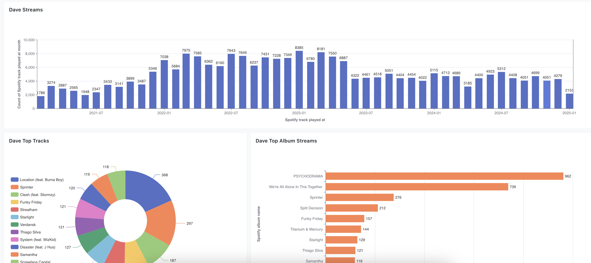

# My Spotify Recommendation Project

---
This is a project that I am working on to create a Spotify recommendation system. I am currently using a combination of Airflow, DBT, Docker, and Lightdash to create a dashboard of my songs but I would like to soon start adding the ML functionality.

This is the an example dashboard that I have created:

## Next Steps:
1. Create an EC2 instance to run an hourly fetch of the last 100 songs from the user.
2. Find an appropriate ML model for item-item recommendation.
3. Create a playlist to display the recommendations.
